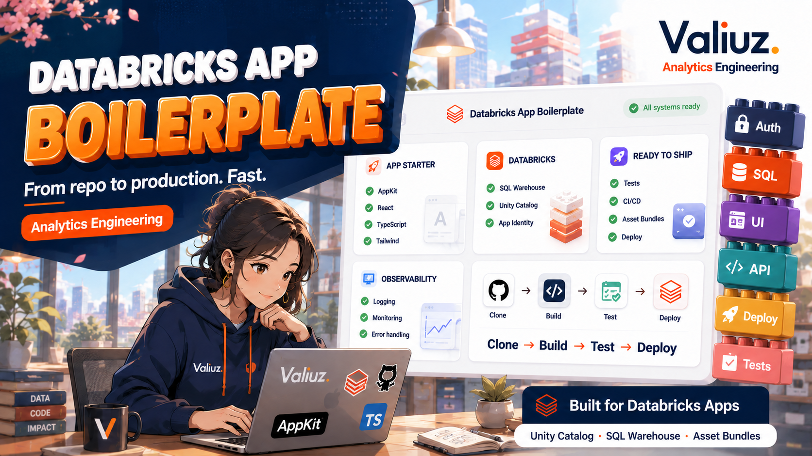

# Databricks App Template



Golden path AppKit/Express/Vite/React/TypeScript pour construire des Databricks Apps analytics. Il fournit un shell UI Valiuz, une
configuration validée, une couche Databricks SQL centralisée, des erreurs publiques sûres, des logs structurés, des
tests, une bibliothèque de visualisation et un déploiement reproductible avec Databricks Asset Bundles.

## Quick Start

Prérequis : Node.js 22.16+, npm et Git. Aucun accès Databricks n’est requis pour le mode démo.

```bash
git clone https://github.com/valiuz/analytics_dbx_app_template.git my-new-app
cd my-new-app
npm ci
npm run app
npm run app -- init my-new-app
npm run app -- guide
npm run app -- next
npm run app -- dev
```

Ouvrir <http://localhost:3000>. Le mode démo est explicite et n’effectue aucun appel distant. La page
<http://localhost:3000/visualizations> présente tous les composants avec des données synthétiques.
`npm run init-app -- --help` affiche les options sans lancer l'initialisation ni modifier les fichiers.
`npm run app -- <commande> --help` donne l'aide du parcours. Les anciennes commandes npm restent disponibles.
L'initialisation refuse une app existante ; utiliser `app next` pour la reprendre ou le guide de migration pour changer de version.
Voir [le parcours CLI complet](docs/cli-workflow.md) pour un essai guidé par une seule personne, du besoin aux données et à l'app.

## Parcours guidé pour une app interne

Le parcours reste volontairement léger pour une app maintenue par une seule personne :

1. `npm run app:guide` consigne utilisateurs, décision, succès et capacités envisagées dans `config/app-spec.yml`.
   Il synchronise `docs/product-brief.md` et propose Analytics, Genie, Files, Serving, Jobs ou les autres capacités utiles.
2. `npm run app:capabilities` décrit les ressources et tests de chaque choix. `npm run app:skills` propose les skills
   Databricks correspondants, à installer hors du code de l'app.
3. Pour un KPI, `npm run data:init -- <nom>` déclare la source, puis `npm run feature:new -- <slug>` génère la tranche.
   Garder le mode `direct` si une table existante suffit. Pour une autre capacité, suivre son guide d'intégration.
4. `npm run app:doctor` indique la prochaine action utile. `npm run check` valide ensuite l'ensemble localement.

Une app Genie seule peut choisir `npm run app:guide -- --type assistant --capabilities genie`.
Elle n'a pas à générer un KPI. Les choix de cadrage n'activent aucun plugin, droit ou ressource.
Voir [le parcours des capacités AppKit](docs/appkit-capabilities.md) pour les intégrations disponibles et leurs limites.

Avec un assistant de développement, demander par exemple :

> Utilise create-analytics-dbx-app pour construire une petite app Valiuz de suivi des commandes.
> Je m'occupe du besoin, des données et de l'app. Prends en charge le parcours complet, en commençant par une démo testée.
> Réutilise ce qui est connu, recommande les choix techniques et pose seulement les questions bloquantes.

`npm run app -- prompt --idea "Suivre les commandes"` produit une variante à copier dans l'assistant.
Le parcours couvre besoin, sources et qualité, KPI, préparation utile, interface, tests et mise en service.
L'agent choisit les commandes et consulte les skills au moment utile. Aucun choix de métier n'est nécessaire.

Le skill orchestre le cadrage, la sélection des skills, l'implémentation et les contrôles dans le périmètre demandé.
`npm run app:orchestrate` propose l'étape de reprise depuis les fichiers actuels, sans les modifier.
Ajouter `-- --json --skills-dir /chemin/vers/les/skills` pour obtenir le plan détaillé et les skills manquants utiles à l'étape.
L'agent peut installer ces skills avec le CLI officiel lorsque la mise en place locale est autorisée.
Il conserve les décisions et les preuves dans `docs/creation-progress.md` de l'app, sans remplacer la spec.
Une feature présente reste à tester ; le diagnostic ne certifie ni son fonctionnement ni les accès distants.
`app next` montre aussi les revues du parcours complet et les contrats data déclarés.
Le résultat distingue une démo testée, des données réelles validées et une mise en service vérifiée.
Voir [le fonctionnement de l'orchestrateur](.agents/skills/create-analytics-dbx-app/references/orchestration.md).

Exemple minimal après avoir confirmé une table existante :

```bash
npm run data:init -- ventes \
  --mode direct \
  --source dev-dtm-media-pm.analytics.ventes \
  --non-interactive
npm run feature:new -- ventes-du-jour
```

Les commandes interactives demandent une information à la fois. Elles n'accèdent pas au workspace et ne déploient
rien.

## Version du template

`template/manifest.yml` donne la version courante et les capabilities du template. La version courante est `2.0.1`.
Ce patch corrige les résultats SQL JSON vides confirmés par Databricks, notamment pour `/api/readiness`.
La version `1.0.0` représente la baseline initiale. Les versions suivantes ajoutent les mises à niveau suivies,
l’historisation bornée, les visualisations, l’assistant Genie OBO et les analyses personnelles.

`init-app` crée `.valiuz-template.yml` dans chaque nouvelle app. Ce fichier indique la version utilisée et les
capabilities attendues. La version dans `package.json` reste la version du package applicatif. Elle est indépendante.

Ces commandes restent locales et ne modifient pas le code de l'app :

```bash
npm run template:status
npm run template:check
npm run template:diff -- --from 2.0.0 --to 2.0.1
npm run template:release:check -- --base origin/main
```

Le diff est un guide sémantique. Il donne les fichiers, les changements et les commandes de validation. Il ne
télécharge rien et n'écrase aucune adaptation métier. Suivre [le guide de mise à niveau](docs/template-upgrades.md)
pour une app qui provient d'une ancienne copie du repository.

Pour une app 1.4 ou 1.5, lancer depuis un checkout **2.0 relu et installé** :

```bash
npm run app -- migrate --app-dir /chemin/vers/ancienne-app
```

Ce bilan en lecture seule ordonne les guides et inventorie le code à porter. L'app inspectée reste intacte.
Le chemin 1.4 passe par les contrats 1.5, avec l'état personnel désactivé si inutile.
React reste utilisé : [la migration](docs/migration-2.0.md) remplace le runtime Next.js par AppKit/Express, Vite et React Router.

## Identité Valiuz et support

Le shell reprend le « V » et la palette Valiuz utilisés par l'app FRAIM. Le même SVG sert de logo dans le header et de
favicon dans l'onglet. Le nom, la description et le contact Slack sont propres à chaque app et sont demandés par
`init-app`. Les tokens, règles de composants et usages data visualisation issus de la charte 2026 sont résumés dans
[le design system analytics](docs/design-system.md).

Le contact reste volontairement simple : un lien HTTPS vers un profil ou un canal du workspace Valiuz. Par défaut,
le lien ouvre directement le profil Slack d'Alexis, comme dans FRAIM. Il peut être remplacé de manière interactive ou
avec :

```bash
npm run init-app -- <nom> \
  --support-name "Prénom ou équipe" \
  --support-slack-url "https://valiuz.slack.com/team/<identifiant>"
```

Ne pas coder un contact personnel en dur dans un composant métier. Modifier `APP_SUPPORT_NAME` et
`APP_SUPPORT_SLACK_URL` via l'initialisation afin que le support reste visible et cohérent dans toutes les pages.

## Bibliothèque de visualisation

Le point d’entrée public `@/components/data-visualization` exporte les composants, leurs types et les fonctions de
formatage. Il expose `DataCard`, `BigNumberKPI`, `Sparkline`, `MiniAreaChart`, `CircularProgress`, `Gauge`,
`MultiMetricCard`, `TimeSeriesChart`, `WaterfallChart`, `AnalyticsMap` et `ChartState`.

`BigNumberKPI` accepte les variantes `plain`, `sparkline` et `gauge`. `MultiMetricCard` combine des valeurs, des
tendances, des mini-barres et des sparklines. `TimeSeriesChart` gère plusieurs séries, une légende interactive, des
infobulles et un tableau de valeurs. `AnalyticsMap` reçoit du GeoJSON, des valeurs par zone et des repères facultatifs.

`NumberFormat` décrit un format numérique `Intl`. `AxisValueFormat` décrit un axe texte, numérique ou date.
Ces contrats sont sérialisables et l’API publique ne déclare aucune prop de callback. Une API de feature peut ainsi préparer les données pour les composants React.

Les composants de données utilisent un même état public :

```ts
type VisualizationState =
  | { status: "ready" }
  | { status: "loading"; label?: string }
  | { status: "empty"; title?: string; message?: string }
  | { status: "error"; title?: string; message: string };
```

L’état `ready` est la valeur par défaut. Les composants affichent des états distincts pour le chargement, l’absence de
données et l’erreur. Importer `READY_VISUALIZATION_STATE` pour partager la valeur par défaut.

Le thème propose les modes clair, système et sombre. Le choix reste dans `localStorage` sous la clé
`analytics-theme`. Le contenu suit ce choix, mais le header Valiuz reste clair pour respecter le média officiel.
Les composants respectent `prefers-reduced-motion`. Les graphiques temporels et la carte proposent aussi un tableau
accessible avec les valeurs exactes.

La carte produit un SVG avec D3 Geo. Elle ne charge aucune tuile, ne demande aucun token et ne fait aucun appel réseau
au runtime. Son SVG, ses contrôles et ses repères acceptent le focus. Le zoom se déplace au pointeur ou avec les
flèches du clavier. Les régions restent hors de l’ordre de tabulation, car le tableau accessible fournit leurs valeurs
exactes.

La page `/visualizations` charge ses données synthétiques via `/api/visualizations`, sans Databricks.
Le module serveur `visualization-demo.ts` convertit l’atlas `world-atlas` embarqué en GeoJSON.

La page propose aussi une [comparaison facultative de périodes](docs/period-comparison.md) : période précédente,
année précédente ou dates personnalisées, filtre commun, valeurs, écarts et contributions en waterfall.
`npm run app -- feature <slug> --date-column <colonne_DATE>` génère cette variante ; ajouter
`--breakdown-column <dimension>` pour les segments et un waterfall sur `count` ou `sum`.
Les moyennes restent pondérées et n'obtiennent pas de waterfall automatique. Les périodes partielles et les références
nulles sont explicites. La démo utilise `/api/period-comparison/demo` ; aucun résultat analytique n'est persisté.

Le partage facultatif ajoute un lien de reprise et une synthèse à copier avec les périodes, filtres, chiffres et réserves.
`--share-analysis` l'active sur une nouvelle feature de comparaison. `--share-segment` autorise une dimension revue comme non sensible.
Le lien fixe les dates et recalcule les données à l'ouverture, sans accorder de droit. La synthèse conserve les chiffres consultés.
Aucun résultat n'est stocké par cette option et aucun message n'est envoyé. Voir [le contrat de partage](docs/period-comparison.md#partager-une-comparaison).

Voir [le design system analytics](docs/design-system.md) pour les API de composition, les tokens et les règles
d’accessibilité.

## Assistant Genie conversationnel

En mode Databricks, le flux passe par le plugin Genie d’AppKit et un client de compatibilité lié à chaque requête.
Le chat Valiuz conserve l’identité OBO, le contexte, le SQL inspectable et l’épinglage. Voir [le contrat et le parcours Genie](docs/genie.md).
Depuis une comparaison compatible, la prop facultative `genie` ouvre une question préremplie avec les deux périodes,
les filtres et les réserves de qualité. L’utilisateur relit puis envoie la question ; les cartes restent en mémoire.

La page `/genie` montre le composant `GenieChat` en vue autonome et à côté de KPI. Le mode démo utilise une
conversation synthétique. Il ne contacte pas Databricks et ne demande aucun jeton.

Le composant accepte un alias de Space, un contexte de dashboard et une variante de mise en page :

```tsx
import { GenieChat } from "@/features/genie";

<GenieChat
  alias="fraim-sales"
  context={{
    filters: { region: "EMEA" },
    dateRange: { label: "90 derniers jours" },
    visibleMetrics: ["Chiffre d’affaires", "Marge"],
    activeTables: ["sales_performance"],
  }}
  height={680}
  variant="embedded"
  onPin={savePinnedInsight}
  onSave={saveConversation}
/>
```

`variant` accepte `standalone`, `embedded`, `panel` et `floating`. `onPin` reçoit un `PinnedGenieInsight` sérialisable.
`onSave` reçoit l’état courant de la conversation. Ces deux objets peuvent contenir des réponses, du SQL et des lignes
gouvernées. Le composant ne choisit aucun stockage partagé.

Le client envoie uniquement l’alias, la question et un contexte validé. Le serveur résout l’alias, construit le
message et appelle l’API Conversation. Dans Databricks Apps, il utilise `x-forwarded-access-token` pour chaque
utilisateur. Le jeton ne passe jamais dans les propriétés React, le JSON de réponse ou les logs.

La route Express dédiée utilise le plugin Genie programmatique. Le client de compatibilité préserve les garanties décrites dans [les exceptions AppKit](docs/appkit-maintenance.md).
La route accepte uniquement les requêtes JSON de même origine. Elle limite le corps à 64 Kio, la question à 10 000
caractères et le contexte sérialisé à 12 000 caractères. Elle résout ensuite le Space et l’identité côté serveur.

Le flux SSE montre les étapes Genie dès leur disponibilité. La réponse prend en charge le Markdown, les tables, les
KPI, les graphiques et le SQL repliable. L’API Genie ne fournit pas de delta de texte. Le client révèle donc le texte
final progressivement, sauf si l’utilisateur demande moins de mouvement. Le serveur envoie aussi des heartbeats SSE
pendant les attentes longues. Un résultat expose au maximum 500 lignes du premier chunk et indique toute troncature.

Le Markdown ne charge aucune image distante : il affiche seulement son texte alternatif. Les liens actifs sont limités
à HTTP(S), aux chemins de même origine qui commencent par un seul `/` et aux fragments `#`. Les autres destinations
restent du texte inerte.

« Arrêter le suivi » ferme uniquement le flux dans cette page. Le traitement Databricks peut continuer. Cette
conversation est alors verrouillée et l’utilisateur doit en démarrer une nouvelle. Dès que le `POST` est envoyé, une
erreur réseau ou un flux incomplet rend la soumission ambiguë. Le client ne propose pas de rejeu et exige une nouvelle
conversation. Le lecteur AppKit ne fournit que le statut d’un refus HTTP avant le flux ; le client conserve donc
la même règle après tout POST échoué, sans proposer de nouvelle soumission automatique.

Le serveur ne rejoue jamais le `POST` qui crée un message. Il retente uniquement les lectures `GET` du message et des
résultats. Ces lectures utilisent cinq reprises au maximum, un délai exponentiel avec jitter, l’en-tête `Retry-After`
et une échéance globale de dix minutes.

En mode Databricks, le processus accepte par défaut huit flux actifs, dont deux par utilisateur. Ces compteurs sont
en mémoire dans chaque processus Node. Ils ne forment pas une limite distribuée entre plusieurs réplicas.

### Ajouter un Space Genie

1. Ajouter le Space, sa clé et ses alias dans `config/genie-spaces.json`. Les alias doivent inclure la clé stable.
2. Ajouter une variable serveur dans `app.yaml`. Utiliser `valueFrom` avec la clé de la ressource.
3. Ajouter la même variable dans `.env.example`. Utiliser un ID de 32 caractères hexadécimaux minuscules.
4. Exécuter `npm run data:access:render`.
5. Examiner le binding `CAN_RUN` et le scope utilisateur `genie` dans la ressource générée.

Les alias sont publics. Les Space ID restent dans la configuration serveur. Un Space ID n’est pas un secret, mais il
ne doit pas devenir un paramètre libre du navigateur.

Pour une URL MCP telle que `.../api/2.0/mcp/genie/<space-id>`, copier uniquement le dernier segment hexadécimal de
32 caractères. Ne jamais enregistrer l’URL complète comme Space ID.

Conserver les callbacks uniquement dans une session ou un stockage privé lié à l’utilisateur. Une composition partagée
doit enregistrer la définition, puis relire les données avec l’identité de chaque lecteur. Ne jamais publier
l’instantané OBO d’un autre utilisateur.

## Analyses et préférences personnelles

La capability optionnelle `personal-user-state` ajoute **Mes analyses** : enregistrer une définition de filtres,
modifier son nom ou sa note, la rouvrir et la supprimer. Des préférences typées conservent la période par défaut
et le tri de la bibliothèque. Le composant `SaveAnalysisButton` se compose dans une vue métier.

Après `init-app`, préparer deux tables Delta dans le datamart de développement sélectionné :

```bash
npm run user-state:init -- --schema my_app_user_state
```

La commande génère localement le DDL et les bindings. Elle ne contacte pas Databricks. Les deux tables personnelles
reçoivent un binding `MODIFY` incluant `SELECT` ; les sources analytiques gardent `SELECT`. Aucun service supplémentaire
n’est nécessaire. La feature reste désactivée jusqu’à la configuration explicite de `USER_STATE_ENABLED`,
`USER_STATE_ORIGIN` et `USER_STATE_NAMESPACE` dans `app.yaml`.

Le serveur isole les données par application, environnement et identité proxy. Chaque modification ajoute une version ;
la dernière selon l’horodatage serveur prévaut, sans fusion des éditions concurrentes. Les résultats SQL et Genie ne sont
pas sauvegardés. Voir [l’analyse du pattern IKEA, la démo et le guide d’activation](docs/user-state.md).

## Workflows d'assistance

Le repository fournit des workflows compatibles avec le standard ouvert Agent Skills :

| Skill | Usage |
| --- | --- |
| `create-analytics-dbx-app` | Orchestrer une création ou une reprise, préparer les skills utiles, implémenter et vérifier la tranche demandée |
| `design-cost-aware-data-history` | Concevoir une historisation avec reprise bornée ou hot/cold, sans imposer un recalcul complet |
| `github-engineer` | Isoler une tâche dans une branche ou un worktree, publier une pull request et nettoyer prudemment le travail fusionné |
| `prepare-template-release` | Décider la version SemVer d'une évolution du template et synchroniser manifeste, migration, tests et documentation |
| `review-analytics-app-docs` | Comparer README, runbooks, manifests et workflows au code et à la configuration réels |
| `test-analytics-app-e2e` | Planifier, écrire et diagnostiquer des parcours Playwright reproductibles en mode démo |
| `validate-analytics-kpis` | Vérifier les contrats de données, calculs, risques statistiques et représentations des KPI |

Les descriptions des skills permettent leur sélection implicite. `AGENTS.md` impose aussi
`prepare-template-release` et `review-analytics-app-docs` à la fin d'une feature du template : il n'est pas nécessaire
de les rappeler dans chaque session. Le bootstrap pose au maximum trois questions à la fois. Toute mutation GitHub ou
Databricks demande une autorisation explicite.

Les skills Valiuz sont inclus dans le template. Les six skills Databricks recommandés restent externes : Core, Apps,
App Design, Data Discovery, DBSQL et Bundles. Les spécialistes Jobs, Model Serving, Lakebase et Vector Search sont proposés selon le besoin.
`npm run app:skills -- --directory /chemin/vers/les/skills` vérifie les points d'entrée sans les modifier.
Le clonage seul n'installe aucun skill amont. Voir [l'installation et la maintenance](docs/appkit-maintenance.md#skills-et-plugins-dagents).

## Infrastructure Valiuz préremplie

Le bootstrap propose les valeurs partagées déjà utilisées par l’app FRAIM :

| Ressource | Valeur par défaut |
| --- | --- |
| Workspace Databricks | `https://3070470996474403.3.gcp.databricks.com` |
| SQL Warehouse | `team-da-poc` (`ab362e9710498a08`) |
| Permission du binding warehouse | `CAN_USE` |
| Space Genie de démonstration | `Genie - FRAIM - Sales Performance` |
| Permission du binding Genie | `CAN_RUN` |

Chaque application choisit aussi un projet de données, représenté par son catalogue Unity Catalog. Les valeurs
autorisées sont `dev-dtm-operating`, `dev-dtm-media-pm`, `dev-dtm-myvaliuz` et `dev-dtm-insight-sharing`.

Avec `npm run init-app -- <nom>`, accepter ces deux valeurs pour cibler l’infrastructure partagée, ou utiliser
`--host` et `--warehouse` pour les remplacer. Le projet/catalogue, le schema et les groupes d’accès restent propres à chaque
application. `CAN_USE` sur le binding autorise l’identité de l’app à utiliser le warehouse ; les privilèges Unity
Catalog et l’accès des utilisateurs à l’app restent à configurer séparément.

## Configuration

`parseAppDisplayConfig` valide la configuration publique au démarrage et pour `/api/config`.
Le navigateur valide aussi ce contrat. Aucune variable runtime n’est requise au build. Le serveur valide la configuration
Databricks complète au démarrage dans `src/lib/config/server-config.ts`.

| Variable | Local démo | Local Databricks | Databricks Apps |
| --- | --- | --- | --- |
| `APP_MODE` | `demo` | `databricks` | `databricks` via `app.yaml` |
| `APP_NAME` / `APP_DESCRIPTION` | valeurs de l'app | mêmes valeurs | injectées via `app.yaml` |
| `APP_SUPPORT_NAME` | nom du contact ou de l'équipe | même valeur | injectée via `app.yaml` |
| `APP_SUPPORT_SLACK_URL` | URL HTTPS `valiuz.slack.com` | même valeur | injectée via `app.yaml` |
| `LOG_LEVEL` | `info` par défaut | même valeur | `info` via `app.yaml` |
| `DATABRICKS_HOST` | non | oui | injectée par Databricks au runtime, absente pendant le build |
| `DATABRICKS_CONFIG_PROFILE` | non | oui, recommandé | jamais utilisée |
| `DATABRICKS_TOKEN` | non | fallback uniquement | jamais utilisée |
| `DATABRICKS_CLIENT_ID` / `DATABRICKS_CLIENT_SECRET` | non | non | injectées par Databricks |
| `DATABRICKS_APP_NAME` | non | non | injectée par Databricks ; SQL utilise M2M et Genie utilise OBO |
| `DATABRICKS_SQL_WAREHOUSE_ID` | non | oui | binding `valueFrom` |
| `DATABRICKS_GENIE_SPACE_ID_FRAIM_SALES` | non lue | ID du Space de test | binding `valueFrom` |
| `GENIE_MAX_CONCURRENT_STREAMS` | non lue | `8` par défaut | `8` via `app.yaml` |
| `GENIE_MAX_CONCURRENT_STREAMS_PER_USER` | non lue | `2` par défaut | `2` via `app.yaml` |
| `DATABRICKS_CATALOG` / `DATABRICKS_SCHEMA` | non | projet autorisé + schema | `app.yaml` |
| `DATABRICKS_SQL_TIMEOUT_MS` | 30 s par défaut | 60 s dans `.env.example` | 30 s par défaut |

Les tables et vues nécessaires sont déclarées dans `config/data-access.json`. Les Spaces Genie sont déclarés dans
`config/genie-spaces.json`. Après chaque modification, exécuter `npm run data:access:render`. Committer les manifestes
avec `resources/data-access.generated.yml`. Ce fichier contient la ressource app, le scope `genie` et les bindings.
Les limites de flux acceptent des entiers de 1 à 100. La limite par utilisateur ne peut pas dépasser la limite globale.

Copier `.env.example` vers `.env.local`. Pour utiliser de vraies données, configurer un profil OAuth avec
`databricks auth login`, passer `APP_MODE` à `databricks`, puis exécuter `npm run databricks:check` et
`npm run test:databricks`. Le premier contrôle lit les métadonnées des sources déclarées ; le second vérifie réellement
`SELECT` sans retourner de ligne. Voir [docs/local-development.md](docs/local-development.md) pour le parcours complet.

### Préparer une table dédiée seulement si nécessaire

`npm run data:init` propose trois niveaux :

| Mode | Quand l'utiliser | Ressource distante ajoutée |
| --- | --- | --- |
| `direct` | une table ou vue existante convient | aucune |
| `notebook` | une sélection ou transformation batch simple doit être rejouée | un Lakeflow Job avec notebook SQL |
| `pipeline` | la préparation est incrémentale, planifiée ou doit produire une materialized view | une pipeline Lakeflow et son Job |

Les modes préparés créent un contrat sous `data/contracts/`, un SQL de départ avec colonnes explicites et un mini-bundle
séparé sous `data/`. Relire le SQL, puis lancer explicitement `npm run data:prepare -- <nom> --confirm` avant de
déployer l'app. Les schedules restent en pause par défaut. L'identité de préparation écrit la table ; l'identité de
l'app ne reçoit que `SELECT` sur la sortie.

Un contrat borné demande aussi `--start-date` et `--end-date` pour chaque exécution manuelle.

Un notebook peut déclarer `bounded-replace`. Le contrat fixe une colonne `DATE`, les fenêtres et le jour finalisé. Il
distingue l'historique requis des rétentions source et sortie. La source doit couvrir la sortie et le délai finalisé.

Le starter matérialise une tranche temporaire. Il contrôle le type `DATE`, les clés nulles et les doublons. Il publie
ensuite la plage avec `BY NAME` et `REPLACE WHERE`. Vérifier le pruning physique et ajouter les contrôles métier avant
le premier run. Une nouvelle sortie utilise le liquid clustering sur la date. Le calendrier du starter est fixé à
`Europe/Paris` ; l'adapter avant le premier run si le contrat métier utilise un autre fuseau.

Après le premier déploiement, afficher une reprise ciblée avec :

```bash
npm run data:replay -- <nom> \
  --profile valiuz-analytics-dev \
  --start-date 2026-08-01 \
  --end-date 2026-08-07
```

Les deux dates sont obligatoires pour une exécution CLI. Ajouter `--confirm` seulement après la revue des cibles. La
commande exécute le Job déployé sans redéployer le bundle. Un fingerprint du contrat et du SQL fait échouer le Job
avant la lecture source si le checkout local ne correspond pas à la préparation déployée.

## Commandes

| Commande | Usage |
| --- | --- |
| `npm run dev` | serveur local avec rechargement |
| `npm run lint` | lint TypeScript et React |
| `npm run typecheck` | vérification TypeScript stricte |
| `npm test` | tests unitaires Node |
| `npm run test:e2e` | parcours Genie dans Chromium avec les fixtures de démo |
| `npm run build` | build Vite et serveur AppKit |
| `npm run check` | manifeste, lint, types, tests unitaires et build de production |
| `npm run app:guide` | cadre l'app et synchronise le brief produit |
| `npm run app` | entrée CLI commune : aide, prompt du parcours complet, génération, reprise et bilan de migration |
| `npm run app:orchestrate` | propose la reprise, les références et les skills utiles depuis l'état du projet, sans mutation |
| `npm run app:capabilities -- --all` | présente les capacités AppKit, ressources, guides et tests à prévoir, sans activation |
| `npm run app:skills` | propose les skills amont utiles et leur installation externe, sans l'exécuter |
| `npm run app:spec:check` | vérifie la spec et le brief |
| `npm run feature:new -- <slug>` | génère une tranche KPI complète à relire |
| `npm run data:init -- <nom>` | déclare une source directe ou prépare un starter notebook/pipeline |
| `npm run data:access:render` | valide le projet et génère les bindings des sources déclarées |
| `npm run data:access:check` | refuse un manifeste invalide ou un fichier généré obsolète |
| `npm run data:prepare:render` | régénère le mini-bundle depuis les contrats data |
| `npm run data:prepare:check` | vérifie les contrats et le mini-bundle de préparation |
| `npm run data:prepare -- <nom> --confirm` | déploie et exécute une préparation data distante |
| `npm run data:replay -- <nom> --start-date <date> --end-date <date> --confirm` | rejoue une plage autorisée sans redéployer le bundle |
| `npm run databricks:check` | préflight en lecture seule du profil, warehouse, projet, schema et sources |
| `npm run test:databricks` | smoke SQL réel sur les sources déclarées, hors CI |
| `npm run bundle:validate` | validation du bundle Databricks |
| `npm run bundle:compatibility` | validation des bundles initialisés avec le Databricks CLI installé, sans workspace distant |
| `npm run template:journey` | parcours complet dans une copie Git propre, avec installation et build de l'app générée |
| `npm run template:status` | affiche la version de l'app et les capabilities trouvées |
| `npm run template:check` | refuse un manifeste invalide ou une capability déclarée mais absente |
| `npm run template:diff -- --from <version> --to <version>` | affiche le guide sémantique entre deux versions |
| `npm run template:release:check -- --base <ref>` | refuse une feature du template sans version, migration et revue documentaire cohérentes |
| `npm run app:provision -- --target prod --profile <profil>` | crée les ressources sans démarrer l'app |
| `npm run app:smoke -- --app <app> --profile <profil>` | teste l'app déployée et ses accès SQL runtime |
| `npm run app:doctor` | affiche les contrôles locaux et la prochaine action |
| `npm run preview:real -- --profile <profil> --confirm` | déploie une preview dev et exécute les smokes |
| `npm run deploy -- --target dev --profile <profil>` | valide, déploie et démarre l’app |

`npm run deploy` modifie des ressources distantes. Vérifier le profil, le workspace, la target et les variables avant
de l’exécuter.

## Structure du repository

```text
src/client/                     React Router, pages, shell et styles
src/server/                     serveur AppKit, routes Express et données synthétiques
src/shared/                     contrats publics sans environnement serveur
src/components/                  shell, états UI et composants génériques
src/components/data-visualization/ point d’entrée public, types et formatage
src/components/{cards,charts,kpi}/ composants de visualisation réutilisables
src/components/maps/            carte cliente, géométrie D3 et sous-composants internes
src/components/theme/            sélection locale du thème clair, système ou sombre
src/features/<feature>/          UI, contrat et logique applicative d’une feature
src/features/<feature>/server/   queries, repository et service serveur
src/features/genie/              chat, contrats, rendu riche et intégration Conversation API
src/lib/config/                  parsing et validation de l’environnement
src/lib/databricks/              authentification et exécution SQL
src/lib/errors/                  taxonomie d’erreurs
src/lib/http/                    wrapper des routes API
src/lib/logging/                 logs JSON et contexte de requête
tests/                           tests unitaires sans Databricks
scripts/                         bootstrap, packaging et déploiement
template/                        manifeste, versions et guides de mise à niveau
config/                          projets, sources Unity Catalog et Spaces Genie déclarés
resources/                       bindings Databricks générés depuis le manifeste
data/                            contrats et préparation optionnelle dans un mini-bundle séparé
public/                          logo et favicon Valiuz partagés par le shell
docs/                            architecture et runbooks
.valiuz-template.yml             état du template dans une app initialisée
```

La boundary attendue est : `UI → service de feature → repository → SqlExecutor → Databricks SQL / Unity Catalog`.

## Ajouter une feature

Après avoir déclaré la source, lancer `npm run feature:new -- <slug>`. Le générateur demande le KPI minimal, crée la
tranche complète et met à jour la navigation, la spec et le brief. Relire systématiquement la requête générée : elle
ne couvre volontairement que `count`, `sum` et `avg` sur une colonne simple.
La carte générée distingue une absence de valeur (« Aucune donnée ») d'une valeur numérique égale à zéro.

Pour une tranche plus riche, conserver la même structure : contrat et composant dans `src/features/<nom>/`, logique
métier dans `server/service.ts`, accès aux données dans `server/repository.ts`, route avec `withApiRoute`, puis tests
avec un `SqlExecutor` factice.
Les handlers sont natifs Express et les paramètres SQL sont nommés. Le lecteur SSE Genie vient d’AppKit UI,
avec les reprises de POST désactivées. La 2.0 ne conserve aucun pont pour les anciens handlers ou paramètres positionnels.

Les composants client ne doivent importer ni la configuration serveur, ni le driver Databricks, ni des credentials.

## Ajouter une requête SQL

Déclarer la requête courte et paramétrée dans `queries.ts`, l’exécuter depuis le repository avec un nom stable et
valider chaque ligne avec Zod. Ne pas interpoler d’entrée utilisateur dans le SQL. Pour une requête longue, utiliser
un fichier `.sql` voisin du repository et documenter son contrat d’entrée/sortie.

Avant d'utiliser une nouvelle table ou vue, l'ajouter à `config/data-access.json`. Son `fullName` doit commencer par le
projet choisi et utiliser le format `projet.schema.objet`. Le repository valide les trois segments et ajoute leurs
backticks. Il lie ensuite la valeur à `IDENTIFIER(:source)`. Il n'interpole aucune entrée utilisateur dans le SQL.

L’exemple `SELECT current_user()` se trouve dans `src/features/connection-check/server/`.

## Déploiement

Le chemin recommandé est `branche → pull request → CI → merge main → déploiement Databricks`. Le bundle possède :

- une target `dev` basée sur les fichiers locaux ;
- une target `prod` Git-backed qui épingle le SHA Git exact résolu par le workflow ;
- un binding SQL Warehouse avec permission `CAN_USE` ;
- un binding `CAN_RUN` par Space Genie déclaré ;
- le scope utilisateur `genie` pour le transfert OBO ;
- un binding `SELECT` par table ou vue déclarée ;
- des permissions `CAN_USE` et `CAN_MANAGE` paramétrables.

Après `init-app`, relire `databricks.yml`, `app.yaml` et `config/data-access.json`, puis suivre
[docs/deployment.md](docs/deployment.md). La GitHub
Action de déploiement utilise OIDC et des variables GitHub, sans secret Databricks committé. L’auto-déploiement reste
désactivé tant que `DATABRICKS_AUTO_DEPLOY` n’est pas `true`. Après l'état `RUNNING`, le workflow appelle `/api/health`
et `/api/readiness` pour vérifier les accès réels du service principal de l'app.

La CI exécute `template:check` et compare la release à la branche de base avec `template:release:check`. Elle refuse une
feature du template sans décision SemVer, guide de migration, README et guide des versions mis à jour. Elle exécute
aussi `npm run template:journey`. Ce parcours crée une copie Git propre et exécute `npm ci`, `init-app`,
`template:status`, `app:guide`, `data:init`, `feature:new`, `app:doctor` et `npm run check`. Un job séparé exécute
les parcours de navigation, visualisation, Genie et analyses personnelles dans Chromium.
Il vérifie le serveur de développement puis le serveur compilé de production sans credentials.
La migration d’une fixture métier 1.5 est également validée dans le repository source.

Un autre job initialise une app et un contrat notebook borné temporaires. Il valide leurs bundles `dev` et `prod` avec
le vrai Databricks CLI. La matrice couvre les versions `0.295.0` et `1.14.1`. Aucun credential Databricks réel n'est lu.

## Troubleshooting

- `INVALID_CONFIGURATION` : vérifier `APP_MODE` et les variables listées au démarrage.
- Le profil CLI n'est pas reconnu : relancer `databricks auth login --host <workspace-url> --profile <profil>`, puis
  `npm run databricks:check`.
- L’app locale affiche « mode démo » : passer explicitement `APP_MODE=databricks` pour interroger le warehouse.
- `SQL_QUERY_FAILED` : utiliser le `requestId` affiché pour retrouver le log serveur ; le SQL et les credentials ne sont
  jamais renvoyés au navigateur.
- `GENIE_AUTH_REQUIRED` : rouvrir l’app Databricks et accepter le scope utilisateur `genie`.
- `GENIE_PERMISSION_DENIED` : vérifier la session et le consentement Databricks, l’accès au Space Genie, au SQL
  warehouse et aux données Unity Catalog requises.
- `GENIE_TIMEOUT` : examiner le `requestId`, puis démarrer une nouvelle conversation si le message avait déjà été créé.
- Le build local utilise une mauvaise version Node : exécuter `nvm use` puis `npm ci`.
- Le déploiement Git-backed ne lit pas GitHub : ajouter un credential Git au service principal de l’app.
- `Data project must be one of` : choisir l'un des quatre projets autorisés dans `config/data-projects.json`.
- `Data access bundle is stale` : lancer `npm run data:access:render` et committer les bindings et métadonnées générés.
- `Data preparation bundle is stale` : lancer `npm run data:prepare:render` et relire le contrat concerné.
- `Product brief is stale` : lancer `npm run app:guide -- --non-interactive`.
- Une capability du template manque : lancer `npm run template:status`, puis lire `docs/template-upgrades.md`.
- `APP_SUPPORT_SLACK_URL` est refusée : utiliser un lien HTTPS vers `valiuz.slack.com`.
- `/api/readiness` échoue : vérifier le projet, les bindings des sources et les droits du service principal de l'app.
- Le bundle refuse des placeholders : relancer `npm run init-app -- <nom>` puis relire les valeurs.

Voir aussi [développement local](docs/local-development.md), [architecture](docs/architecture.md),
[Databricks](docs/databricks.md), [déploiement](docs/deployment.md) et [AGENTS.md](AGENTS.md).

## Runtime 2.0 et mises à jour amont

AppKit 0.76.1 fournit le serveur Express, Vite en développement et les fichiers statiques en production.
Les APIs des features conservent les services, repositories et validations Valiuz.
Les lectures compatibles utilisent AppKit analytics ; Genie et les écritures personnelles conservent leurs garanties existantes.
Le registre de compatibilité documente chaque exception et son critère de suppression.

La migration reste volontaire : suivre [le guide 1.5 vers 2.0](docs/migration-2.0.md).
`npm run template:migration` valide une fixture métier 1.5 après portage.
La [maintenance amont](docs/appkit-maintenance.md) décrit les versions, skills externes, PR hebdomadaires et contrôles en lecture seule.
Un déploiement de développement explicitement autorisé et sa recette restent nécessaires avant adoption en production.
